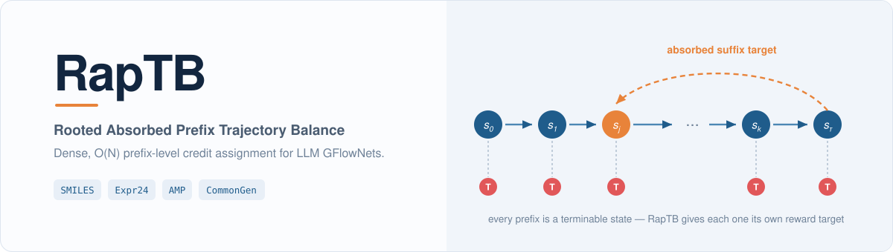
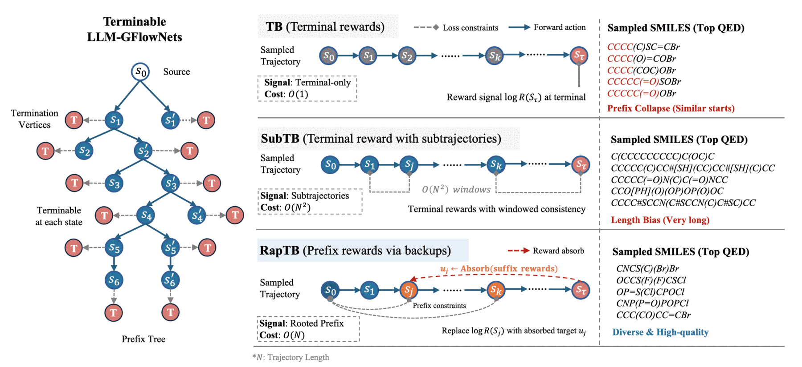

<p align="center">
  <picture>
    <source media="(prefers-color-scheme: dark)" srcset="assets/readme/hero-dark.svg">
    
  </picture>
</p>

<p align="center">
  <a href="https://icml.cc/virtual/2026/poster/65366"></a>
  <a href="#installation"></a>
  <a href="#installation"></a>
  <a href="#installation"></a>
  <a href="configs/"></a>
  <a href="LICENSE"></a>
</p>

Official implementation of **RapTB: Rooted Absorbed Prefix Trajectory Balance**, an objective for
training large language models as GFlowNets.

## Why

Training an LLM as a GFlowNet means learning to **sample** sequences in proportion to reward
rather than to maximise it. The standard objective, **Trajectory Balance (TB)**, gives exactly one
learning signal per trajectory — at the terminal state. Over a long sequence that is too sparse,
and the policy collapses onto a handful of short prefixes. The natural fix, **Subtrajectory
Balance (SubTB)**, imposes `O(N²)` windowed constraints that a policy can partially satisfy by
globally suppressing its stop probability, so it drifts toward maximum length and stops producing
valid outputs.

**RapTB** sits between them. It keeps one residual per prefix — `O(N)` constraints, all rooted at
the source so the learnable normaliser cancels — and replaces each prefix's raw stop-reward with
an **absorbed suffix target** backed up from the trajectory's own future. **SubM** (submodular
replay) is a drop-in buffer that selects stored trajectories for diversity and length coverage
instead of reward alone.

Dense credit assignment, without termination drift.

## Results

Scaffold-conditioned SMILES optimisation, Llama-3.2-1B + LoRA, `L_max = 10`. Metrics computed on
valid samples; `Len` is mean token length.

| Method | Acc ↑ | Score ↑ | Entropy ↑ | FPDiv ↑ | Len |
|:--|--:|--:|--:|--:|--:|
| PPO | 1.000 | 0.604 | ≈0 | — | — |
| GRPO | 0.997 | 0.661 | 0.98 | — | 10.0 |
| TB | **0.998** | 0.717 | 2.503 | 0.807 | 3.065 |
| SubTB | 0.328 | 0.755 | 2.127 | 0.836 | 8.354 |
| RapTB | 0.996 | 0.740 | 2.448 | 0.860 | 6.142 |
| **RapTB + SubM** | 0.988 | **0.844** | **2.726** | **0.898** | 7.435 |

TB reaches near-perfect validity but concentrates on very short strings. SubTB's validity collapses
to 0.328 — the termination drift described above. RapTB + SubM holds validity while taking the best
quality–diversity trade-off.

Expr24 — generate an arithmetic expression evaluating to 24; sparse, exactly verifiable reward —
across replay schemes:

| Replay | Objective | Unique✓ ↑ | NormCov ↑ | Acc ↑ | JS<sub>tok</sub> ↓ |
|:--|:--|--:|--:|--:|--:|
| RP | TB | 5.3 | 0.001 | 1.000 | 0.339 |
| RP | SubTB | 324.7 | 0.051 | 0.229 | 0.109 |
| RP | RapTB | 246.7 | 0.039 | 0.991 | 0.147 |
| SubM | TB | 642.0 | 0.100 | 0.996 | 0.049 |
| SubM | SubTB | 331.3 | 0.052 | 0.061 | 0.040 |
| **SubM** | **RapTB** | **1337.3** | **0.209** | 0.994 | 0.048 |

TB under standard replay finds 5.3 unique correct expressions. RapTB + SubM finds 1337.3 while
holding accuracy at 0.994.

Confidence intervals, per-length breakdowns, the `L_max = 15` stress test, and the AMP and
CommonGen results are in the paper.

## Method

<p align="center">
  
</p>

Every prefix of a sequence is a state that can terminate. TB attaches a reward only at the
terminal — `O(1)` signal. SubTB enforces consistency over all `O(N²)` sub-windows. RapTB keeps
`O(N)` rooted prefix residuals and replaces `log R(s_j)` with an absorbed target `u_j` backed up
from the suffix.

## Installation

Clone with submodules — grammar-constrained sampling needs the `gflow` fork of
`transformers_cfg`, which is vendored as a submodule:

```bash
git clone --recurse-submodules https://github.com/ComDec/ChemGFN.git
cd ChemGFN
```

Already cloned? `git submodule update --init --recursive`.

```bash
conda env create -f environment.yaml
conda activate chemgfn
pip install -e .
pip install -e third_party/transformers-CFG      # the gflow fork
```

`pyproject.toml` is the single source of truth for dependencies; `environment.yaml` only pins the
Python runtime and the two binaries that are painful to build from source (PyTorch, RDKit).

> [!IMPORTANT]
> Install `third_party/transformers-CFG`, not the PyPI `transformers_cfg`. The released package
> does not provide the incremental grammar processor these tasks use, so training fails at import
> without the fork.

The SMILES, Expr24 and AMP tasks fine-tune `meta-llama/Llama-3.2-1B`, a **gated** model. Request
access on the Hub, then:

```bash
huggingface-cli login
```

Training logs to Weights & Biases by default:

```bash
wandb login          # or: export WANDB_MODE=offline
```

CommonGen needs extra NLP dependencies:

```bash
pip install -e ".[commongen]"
python -m spacy download en_core_web_sm
```

## Quickstart

Every run is a Hydra experiment config.

```bash
# Train RapTB + SubM on SMILES
python chemgfn/train.py experiment=smiles/raptb_subm

# Evaluate a checkpoint you trained
python chemgfn/eval.py experiment=smiles/raptb_subm \
  ckpt_path=logs/train/smiles_raptb_subm/train/runs/<timestamp>/checkpoints/last.ckpt \
  +trainer.limit_test_batches=100 test_repeats=3
```

Anything in the config can be overridden on the command line:

```bash
python chemgfn/train.py experiment=smiles/raptb_subm trainer.max_steps=2000 seed=1
```

## Reproducing the paper

**No trained checkpoints are released** — reproducing a number means retraining from its config.
Each config carries a header comment naming the exact table and row it produces.

| Config | Reproduces |
|:--|:--|
| `smiles/{tb,subtb,raptb,raptb_subm}` | Table 1 — SMILES, `L_max = 10` |
| `smiles/{tb_subm,subtb_subm}` | Appendix — SubM applied to the TB and SubTB baselines |
| `smiles/avgprefixtb` | Appendix — AvgPrefixTB baseline |
| `smiles/ablation_tb_no_reference_prior` | Ablation — TB without the reference prior |
| `smiles/ablation_raptb_absorb_{max,soft}_only` | Ablation — backup variants |
| `smiles_len15/{tb,subtb,raptb,raptb_subm}` | Table 3 — long-horizon stress test, `L_max = 15` |
| `expr24/{rp,prt,subm,oracle}_{tb,subtb,raptb}` | Table 4 — Expr24 across four replay schemes |
| `expr24/{rp,oracle}_rootsubtblogz` | Termination-drift diagnostic |
| `expr24/rp_avgprefixtb` | Appendix — AvgPrefixTB on Expr24 |
| `amp/{tb,subtb,raptb,raptb_subm}` | Appendix — AMP peptide generation |
| `commongen/{tb,subtb,raptb,raptb_subm}` | Table 5 — CommonGen |

Batch evaluation, once you have checkpoints:

```bash
CKPT_ROOT=/path/to/checkpoints GPUS="0 1 2 3" bash scripts/run_eval_all.sh
```

Checkpoint directories are named after each experiment's `exp_name`, which is its config path with
`/` replaced by `_` (`smiles/raptb_subm` → `smiles_raptb_subm`). The evaluation protocol — 100 test
batches, 3 independent sampling repeats — is fixed in the scripts because it is the protocol the
reported numbers use.

## Repository layout

```
chemgfn/
  train.py  eval.py          Hydra entry points
  models/
    gfn.py                   ChemGFNModule — generation, reward, logging
    losses.py                TBLoss, SubTBLoss, RapTBLoss, RootSubTBLogZLoss, AvgPrefixTBLoss
    reward.py                reward shaping against the reference prior
    validators.py            RDKit / Expr24 / AMP / CommonGen scoring
  data/                      prompt and buffer data modules
  utils/
    replay_buffer.py         ReplayBuffer and the submodular (SubM) buffer
    schedulers.py            per-step factor schedules
configs/                     Hydra configs; configs/experiment/ is the entry point
assets/                      CFG grammars and per-tokenizer legal-token lists
data/                        task prompts, buffers, AMP reward oracle
scripts/                     buffer generation and batch evaluation
tests/                       CPU test suite
```

## Tests

```bash
pip install -e ".[dev]"
pytest tests/
```

The suite runs on CPU with no GPU, no W&B account and no gated-model access; tests that would need
those skip cleanly.

## Known limitations

Stated plainly so nobody hunts for something that is not here.

- **Grammar-constrained sampling needs the `gflow` fork of `transformers_cfg`**, vendored as the
  `third_party/transformers-CFG` submodule. The PyPI package (0.2.6 / 0.2.7) does not provide
  `GrammarIncrementalLogitsProcessorGeneral`. Clone with `--recurse-submodules`.
- **No released checkpoints.** Every reported number requires retraining.
- **PPO / GRPO baselines** (rows in the SMILES and Expr24 tables) were produced with external
  TRL-based scripts and are not part of this repository.
- **The 3B / 8B / 32B scaling study** is a backbone swap over the same configs and is not shipped
  here.
- `data/AMP/oracle_weights.pt` is the reward oracle for the AMP benchmark from Jain et al. (2022),
  not a model of ours.

## Citation

```bibtex
@inproceedings{raptb2026,
  title     = {RapTB: Rooted Absorbed Prefix Trajectory Balance for LLM GFlowNets},
  booktitle = {Proceedings of the 43rd International Conference on Machine Learning (ICML)},
  year      = {2026},
  url       = {https://icml.cc/virtual/2026/poster/65366}
}
```

## License

[MIT](LICENSE). Model weights, datasets and third-party packages referenced here carry their own
licenses — in particular Llama-3.2 is governed by the Llama Community License.
